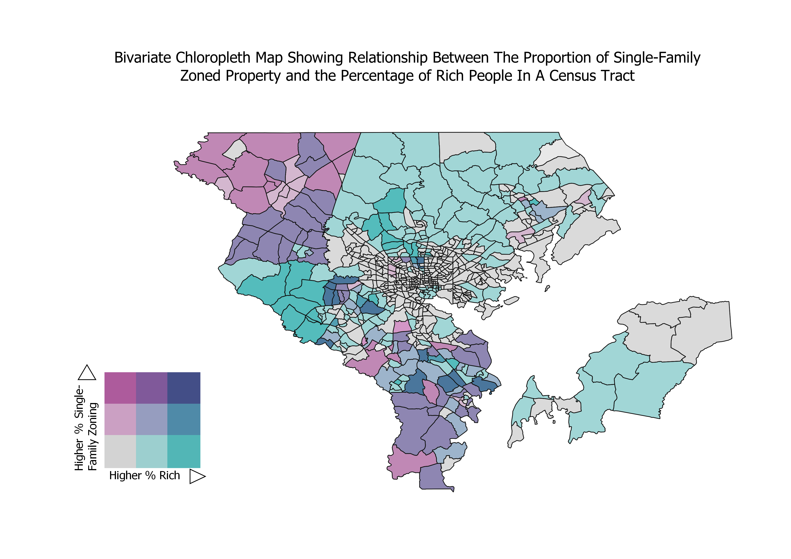
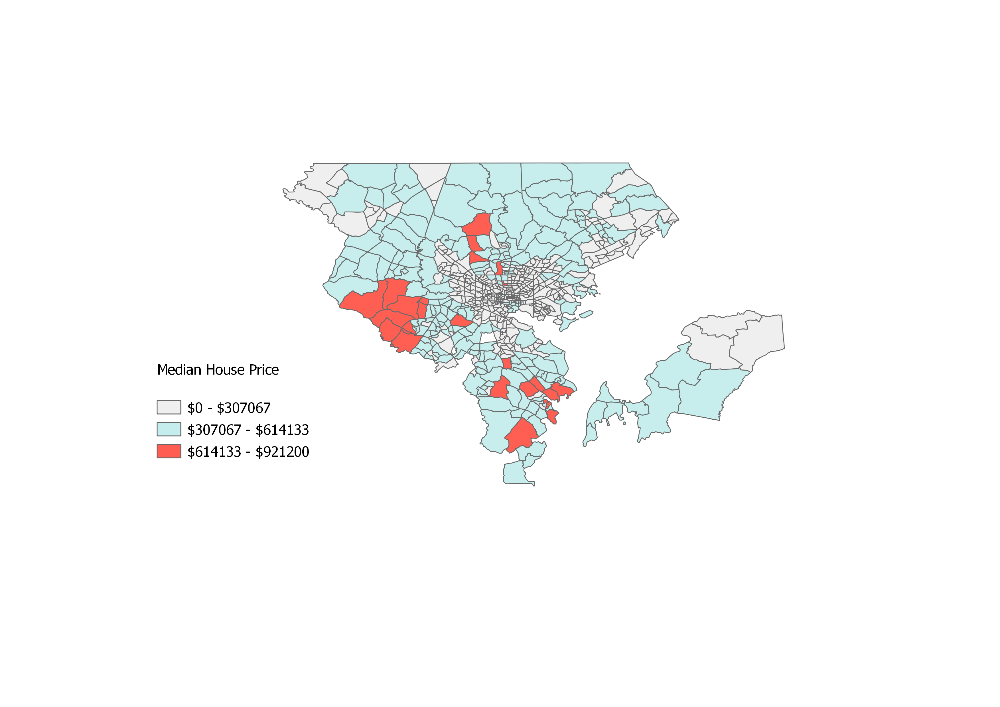

# Single-Family Zoning (SFZ) Map Portfolio 
This page is designed to showcase the portfolio of maps I created for my final project in GES 687. This project centered around mapping and analyzing single-family zoning restriction policies in the Baltimore region, as well as analyzing the relationship they have with various community outcomes. Scroll below to view the zoning maps I created, and scroll to the bottom to view my analysis of the results.

---

### Methodology

Obtaining data and creating maps for this project came from multiple sources. Obtaining data on zoning and community demographics were taken from the Maryland Department of Planning and the American Community Survey. Shapefiles on zoning was taken using the State Department of Assessments and Taxation (SDAT) dataset which contains data on most maryland properties detailing zoning and land use codes. Community demographics such as race, income, and education were taken from the ACS survey, an annual survey that obtains data on millions of U.S. households. ACS data was loaded into R statistical software using the tidycensus program, and was then transformed into shapefiles that could be loaded into QGIS Mapping software. Once these shapefiles were created, both the demographic data and zoning maps data were loaded into QGIS and transformed to create the land-use and chloropleth maps shown above. 

---

# Results

### [Full Single-Family Zoning Map](/project_probation/index)
This map shows the full display for all single-family zoned land in Central Maryland (measured by land-use data) 
[]

---
### [Single-Family Chloropleth Map](/project_probation/index)
This map displays the relationship between the proportion of single-family zoned properties in a census tract and the median household income of that area.
[]

---
### [Median House Price Map](/project_probation/index)
This map shows the median houseprice of the census tracts in the Baltimore region. 
[]

---
### [Baltimore City SFZ Map](/project_probation/index)
This map displays where single-family zoning restrictions exist in Baltimore City 
]

---
### [Baltimore County SFZ Map](/project_probation/index)
This map displays where single-family zoning restrictions exist in Baltimore County
[]

---

### [Anne Arundel County SFZ Map](/project_probation/index)
This map displays where single-family zoning restrictions exist in Anne Arundel County
[]

---
### [Howard County Zoning Map](/project_pnw/index)
This map displays where single-family zoning restrictions exist in Howard County

---
### [Carroll County SFZ Map](/project_probation/index)
This map displays where single-family zoning restrictions exist in Carroll County
[]

---
### [Harford County SFZ Map](/project_probation/index)
This map displays where single-family zoning restrictions exist in Harford County
[]

---
### [Queen Anne's County SFZ Map](/project_probation/index)
This map displays where single-family zoning restrictions exist in Queen Anne's County
[]

---

### Analysis

Overall, the results of my research suggest that single-family zoning restrictions are not highly prevalent in the Baltimore region. Despite this, these zoning policies are still associated with higher income areas, indicating that these zoning policies significantly affect the income distributions of various communities in the region. Regression analysis using OLS and Fixed effects was also performed to gain a more in-depth understanding of the effect that single-family zoning has on communities in the region. It was found that single-family zoning not only singnificantly shifted the income distribution towards those with the highest incomes, but it was also found that these zoning policies were also associated with higher median house-prices, and interestingly, lower educational attainment. To view more information about this research 
<a href="https://github.com/jjustin1/jjustin1capstonepaper/blob/main/JustinJohnsonCapstoneGithub.pdf" target="_blank">Click Here.</a>

