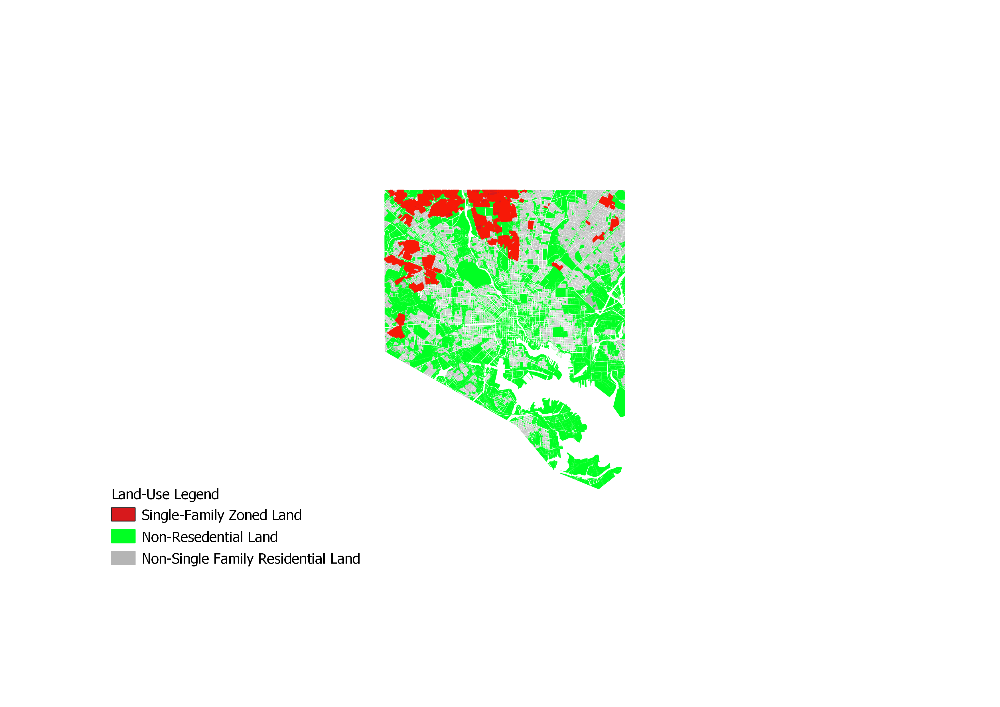

## Single-Family Zoning (SFZ) Map Portfolio 

---
### [Full Single-Family Zoning Map](/project_probation/index)
This map shows the full display for all single-family zoned land in Central Maryland (measured by land-use data) 

---
### [Single-Family Chloropleth Map](/project_probation/index)
This map displays where single-family zoning restrictions exist in Baltimore City 

---
### [Baltimore City SFZ Map](/project_probation/index)
This map displays the relationship between the proportion of single-family zoned properties in a census tract and the median household income of that area.

This map displays where single-family zoning restrictions exist in Baltimore County

---

### [Anne Arundel County SFZ Map](/project_probation/index)
This map displays where single-family zoning restrictions exist in Anne Arundel County

---
### [Howard County Zoning Map](/project_pnw/index)
This map displays where single-family zoning restrictions exist in Howard County

---
### [Carroll County SFZ Map](/project_probation/index)
This map displays where single-family zoning restrictions exist in Carroll County

---
### [Harford County SFZ Map](/project_probation/index)
This map displays where single-family zoning restrictions exist in Harford County

---
### [Queen Anne's County SFZ Map](/project_probation/index)
This map displays where single-family zoning restrictions exist in Queen Anne's County

---

### Category Name 2

- [Project 1 Title](http://example.com/)
- [Project 2 Title](http://example.com/)
- [Project 3 Title](http://example.com/)
- [Project 4 Title](http://example.com/)
- [Project 5 Title](http://example.com/)

---
